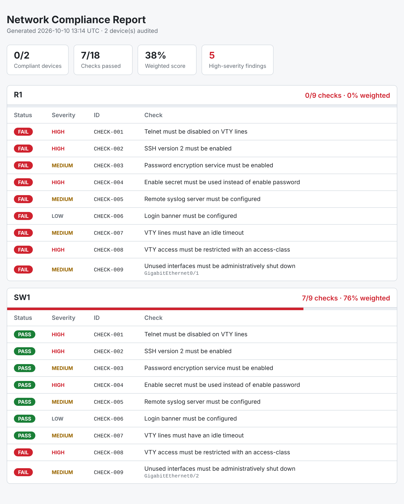

# network-compliance-ansible


Network compliance audit framework built with Ansible. It checks network device configurations against a set of security rules and produces a consolidated HTML report.



## Features

- **Data-driven rules**: compliance checks are defined in YAML, not hard-coded in tasks. Adding a check means adding four lines of YAML.
- **Full audit, then verdict**: every check runs on every device; the play only fails at the end if a device is non-compliant.
- **Consolidated HTML report**: one report for all devices, with per-device scores and check details.
- **Offline mode**: audits configuration files without any live device, which makes the whole project testable in CI.
- **Quality gates**: `ansible-lint` (production profile) and `gitleaks` secret scanning on every push.

## How it works

```
rules/cisco_ios.yml ──┐
                      ├──► role: compliance_audit ──► console summary
samples/configs/*.cfg ┘                            └► reports/compliance-report.html
```

A rule looks like this:

```yaml
- id: CHECK-001
  title: Telnet must be disabled on VTY lines
  pattern: 'transport input (all|.*telnet)'
  expect: absent   # present = must be found, absent = must not be found
```

## Current checks (Cisco IOS)

| ID | Check |
|---|---|
| CHECK-001 | Telnet must be disabled on VTY lines |
| CHECK-002 | SSH version 2 must be enabled |
| CHECK-003 | Password encryption service must be enabled |
| CHECK-004 | Enable secret must be used instead of enable password |
| CHECK-005 | Remote syslog server must be configured |
| CHECK-006 | Login banner must be configured |
| CHECK-007 | VTY lines must have an idle timeout |
| CHECK-008 | VTY access must be restricted with an access-class |

## Quick start

```bash
python3 -m venv .venv && source .venv/bin/activate
pip install -r requirements.txt
ansible-galaxy collection install -r requirements.yml
ansible-playbook playbooks/audit.yml
open reports/compliance-report.html   # macOS (use xdg-open on Linux)
```

The sample configs are intentionally imperfect: `R1` is non-compliant and `SW1` is compliant, so the audit is expected to fail on `R1`.

## Role variables

| Variable | Default | Description |
|---|---|---|
| `compliance_audit_checks` | `[]` | List of checks to evaluate |
| `compliance_audit_config_file` | `""` | Path to the device configuration to audit |
| `compliance_audit_fail_on_noncompliance` | `true` | Fail the host if at least one check fails |
| `compliance_audit_report_enabled` | `true` | Generate the HTML report |
| `compliance_audit_report_path` | `reports/compliance-report.html` | Report output path |

## Project structure

```
├── inventories/offline/      # Inventory for offline (file-based) audits
├── playbooks/audit.yml       # Entry point
├── roles/compliance_audit/   # Audit logic, report template
├── rules/cisco_ios.yml       # Compliance rules
├── samples/configs/          # Sample device configurations
└── .github/workflows/ci.yml  # Lint + secret scanning
```

## Roadmap

- [x] **Level 1**: inventory, first checks (SSHv2, telnet)
- [x] **Level 2**: role, YAML-defined rules, HTML report
- [ ] **Level 3**: live devices (GNS3 lab), resource modules, `show` output parsing
- [ ] **Level 4**: remediation (check/diff mode, config backup, rolling changes)
- [ ] **Level 5**: custom plugins, Molecule tests, Execution Environment, AWX

## License

MIT
